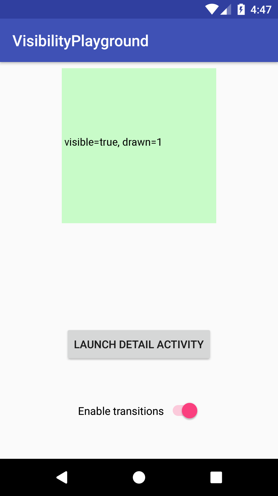
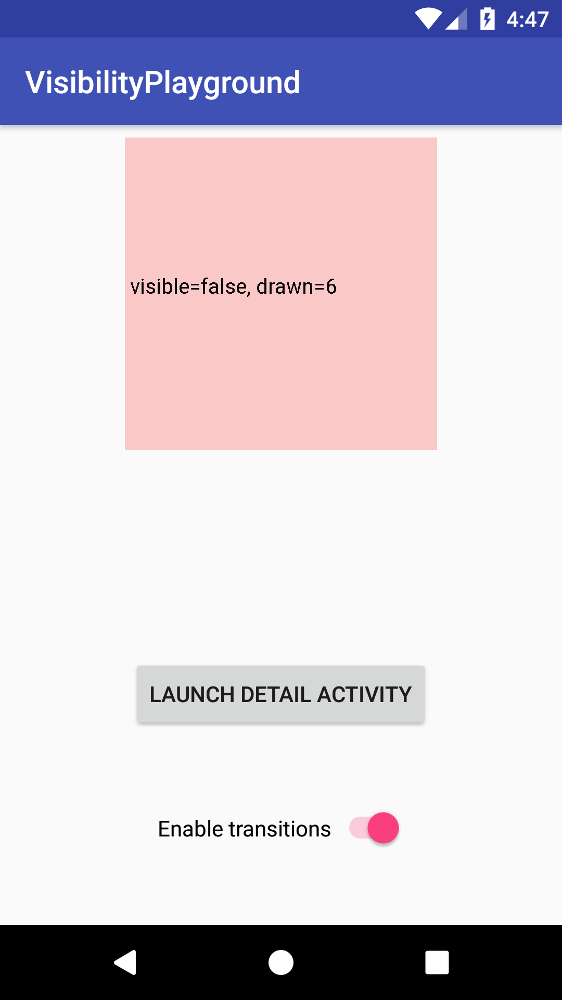

# VisibilityPlayground
Starting with Android N, ImageView doesn't properly forward visibility events to its underlying drawable if activity transitions are used. This sample app showcases the issue.

This sample app has 2 Activities. The main one holds an ImageView that displays a debug drawable and has a button to transition to Activity 2 and a toggle to enable / disable activity transitions.
The debug drawable just prints whether it is visible and changes the background color accordingly (green = visible, red, invisible).

If your target SDK is >= 24 and activity transitions enabled, you'll notice that when you transition from A -> B and go back to A, the Drawable in A will have its visibility set to false instead of true.
Everything works properly if transitions are disabled.

